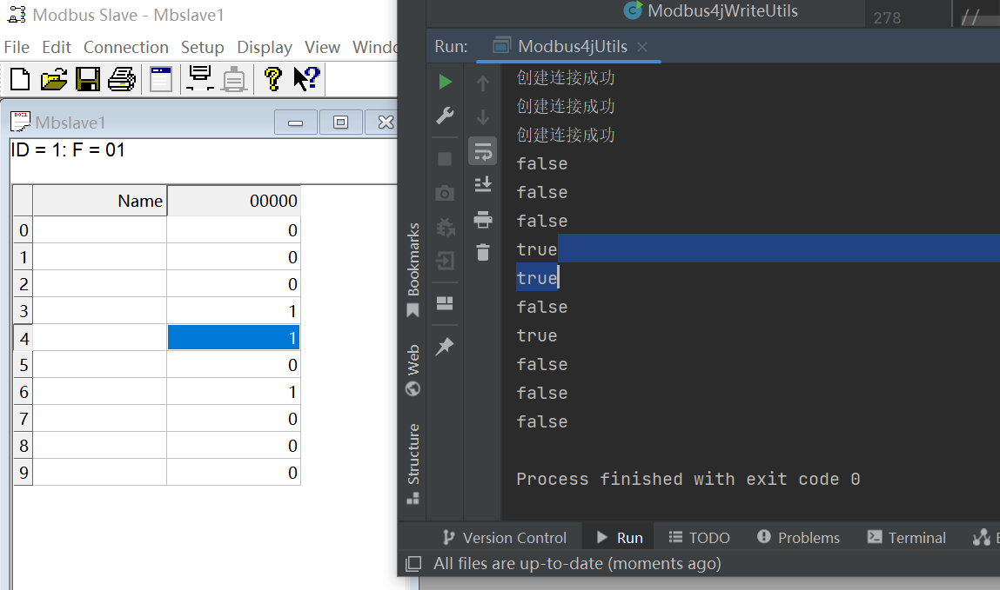

## 个人简历

- 姓名：陈振辉
- 性别：男
- 出生年：2001
- 毕业院校：石家庄铁道大学 信息科学与技术学院 软件工程专业
- 工作年限：0年

## 学习情况

- 在大学中，我作为软件工程系的学生，学习了C，Java，Python，JavaScript，css等编程语言，还学习了数据库、uml、数据结构、线性代数等相关课程。

## 社会活动情况

在疫情期间曾帮助村委会进行人口流动调查等工作。

## 专业实践情况

- 参加过河北联冠科技有限公司的实践活动，在该公司学习了物联网方面的相关知识，构建了一套简单的隧道环境检测系统

## 专业技能展示
- 近期学习内容：物联网相关，Java语言通过Modbus TCP协议远程连接PLC读取设备状态，模拟测试如下图
- 

## 专业博客发表
[JDBC连接数据库](https://www.cnblogs.com/333czh/p/15578227.html) 
[archLinux虚拟机安装](https://www.cnblogs.com/333czh/p/17267992.html) 
[搭建简单JavaWeb项目](https://www.cnblogs.com/333czh/p/16423830.html)
## 联系方式

邮箱:3334986931czh@gmail.com

微信:HZCWeC

